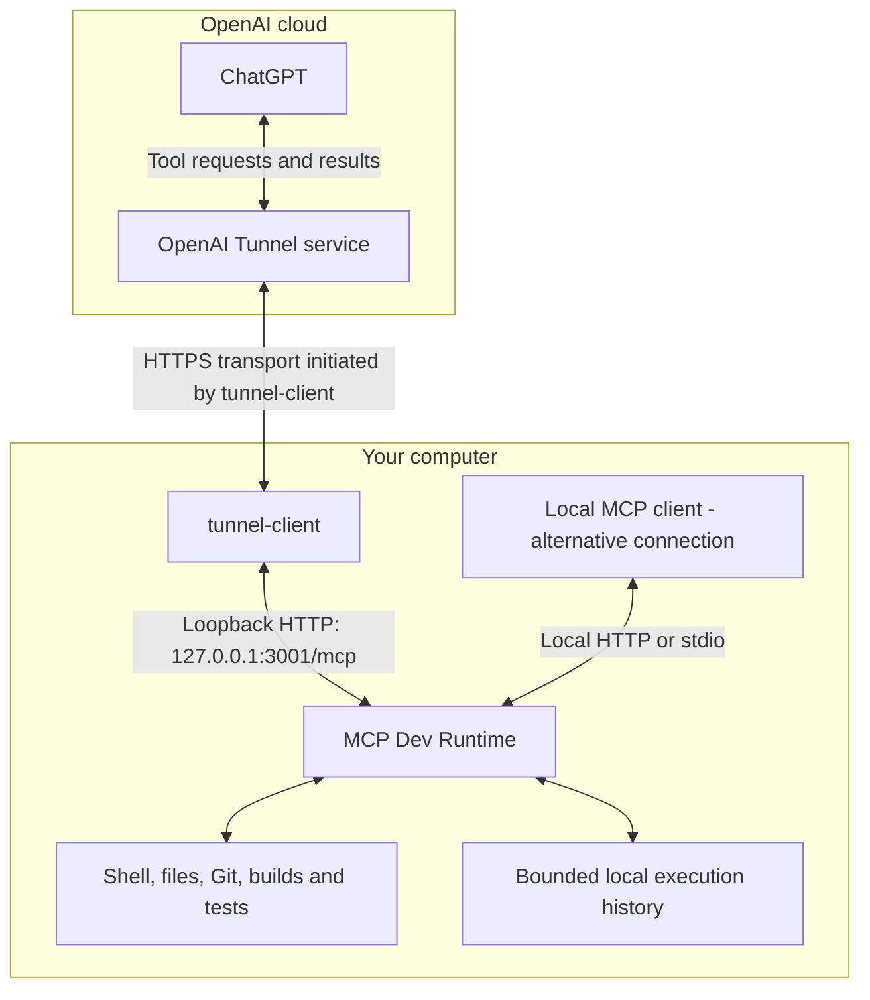

# MCP Dev Runtime

**Give your MCP client direct access to your own development environment.**

**English** | [简体中文](docs/README.zh-CN.md)

> **Want to connect ChatGPT to your computer?** [English setup guide](docs/CHATGPT_SETUP.md) · [简体中文图文教程](docs/CHATGPT_SETUP.zh-CN.md)

Shell commands, interactive terminals, file patches, images and execution history through six MCP tools. Connect locally over HTTP or stdio, or connect ChatGPT through the optional OpenAI Secure MCP Tunnel.

This is an independent community project, not an OpenAI product. The runtime executes operations itself: it does **not** launch Codex, delegate to another agent, or call a model API. It is not a remote-desktop viewer or a mouse/keyboard automation service.

> **Trust boundary:** commands run with the service user's OS permissions. There is no sandbox, command allowlist, additional approval layer or multi-user isolation. Keep the listener on loopback and connect only trusted clients. Returned files, logs and images reach the calling client; local execution does not mean local-only data handling. Read [SECURITY.md](SECURITY.md) before connecting a machine.

**Precompiled v1.2.0:** [Download the matching runtime package](https://github.com/dolibali/mcp-dev-runtime/releases/tag/v1.2.0) · [Installation and upgrade guide](docs/BINARY_INSTALL.md). Includes Node, native dependencies and the pinned Tunnel; no build toolchain is needed. Publisher signing / Apple notarization are skipped for this release.

## Contents

[Choose a connection](#connection) · [Requirements](#requirements) · [Install](#install) · [Global command / mdr](#global-command) · [Local HTTP / stdio](#local) · [ChatGPT deployment](#chatgpt) · [Tools](#tools) · [History](#history) · [Configuration](#configuration) · [Operations](#operations) · [Logs](#logs) · [Troubleshooting](#troubleshooting) · [Validation](#validation) · [Documentation](#documentation)

<a id="connection"></a>
## Choose a connection

| Use case | Connection | Startup |
| --- | --- | --- |
| A local MCP client that supports HTTP | Loopback Streamable HTTP | `npm start -- --config config.json` |
| A client that starts an MCP subprocess | stdio | Configure the client to run `node …/dist/main.js --transport stdio …` |
| ChatGPT accessing your private computer | OpenAI Secure MCP Tunnel → local HTTP | `npm run up -- --env-file runtime.env --background` |



Arrows show **request/response data flow**, not who opens an inbound network connection. The local `tunnel-client` initiates outbound HTTPS to OpenAI, receives work, forwards it to MCP Dev Runtime over loopback HTTP, and returns the result. ChatGPT does not connect directly to your `localhost`, and no public inbound port is required. The local-client path bypasses Tunnel entirely; it is an alternative, not an extra required component. Platform and workspace access remain prerequisites. See the [official Tunnel guide](https://developers.openai.com/api/docs/guides/secure-mcp-tunnels).

**Choose one startup method per instance.** `npm start` starts only MCP; `npm run up` starts both MCP and Tunnel. Running both on port 3001 causes a port conflict. Local-only use does not require Tunnel credentials or Go.

<a id="requirements"></a>
## Requirements

For the recommended **precompiled distribution**, use a matching macOS/Linux tarball or Windows x64/ARM64 ZIP; no external Node/npm/Go/compiler is required. See [binary installation](docs/BINARY_INSTALL.md) and [Windows installation](docs/WINDOWS.md). The table below applies to **macOS/Linux source development**, not the release installer. Windows source development requires Node/npm and the pinned Go toolchain, without MSVC or WSL.

| Requirement | When needed |
| --- | --- |
| [Node.js 24 or newer](https://nodejs.org/en/download), with npm | Installation, TypeScript build and runtime |
| Git | Cloning, source workflows and optional Tunnel source retrieval |
| ripgrep (`rg`) | Recommended for code search and diagnostic toolchain checks |
| Python 3 and a C/C++ toolchain | Native dependency builds when compatible prebuilt packages are unavailable |
| Go and `make` | **Only** when building the pinned Tunnel client from source; this pin declares Go **1.27.0** in `go.mod` |

Verify the basics in the terminal that will launch the service:

```bash
node --version
npm --version
git --version
rg --version
```

On macOS, install Xcode Command Line Tools with `xcode-select --install` if native builds require them. On Debian/Ubuntu, the usual native build dependencies are `build-essential`, `python3` and `pkg-config`; install Node.js separately and confirm it meets the requirement. See [node-pty's build prerequisites](https://github.com/microsoft/node-pty#dependencies). Do not run this project with `sudo`.

Precompiled release verification requires macOS 14 ARM64, macOS 15 Intel, Ubuntu 22.04 x64/ARM64, Windows Server 2025 x64 and Windows 11 ARM64 native runners. Exact package results are published in `VERIFICATION.json`; mock/local lifecycle tests do not claim real cloud connectivity. Source regression checkpoints remain in [VALIDATION.md](docs/VALIDATION.md).

<a id="install"></a>
## 1. Install

**Recommended:** download a [precompiled release](https://github.com/dolibali/mcp-dev-runtime/releases/tag/v1.2.0), verify its SHA-256, extract it and run `./install.sh` on macOS/Linux or `.\install.ps1` in Windows PowerShell. The [binary guide](docs/BINARY_INSTALL.md) and [Windows guide](docs/WINDOWS.md) cover user directories, commands, upgrade and rollback. Release installers do not compile or download dependencies.

**v1.0.1 and later:** complete uninstall is `./uninstall.sh`. It lists every owned path it will remove and proceeds only after the user enters `y`; precompiled installation also preserves a stable user-level copy so the downloaded archive does not need to be kept. The immutable v1.0.0 archive predates this feature and retains its command-only `./install.sh --unregister`.

### Source development alternative

The shell commands below target macOS/Linux. For native Windows source setup, use the [Windows source guide](docs/WINDOWS.md#source-development-and-validation) instead; do not install Bash or WSL merely to run these examples.

Clone the repository below; a private repository requires an account with access. For a fork, use its clone URL instead. For an extracted source archive, skip cloning and enter the extracted project directory.

```bash
git clone https://github.com/dolibali/mcp-dev-runtime.git
cd mcp-dev-runtime
./install.sh
```

The setup is intentionally local and repeatable. New installations create only **one non-secret `config.json` plus private `runtime.env`** when missing, then verify or build the Tunnel source pinned by `tunnel.lock.json` and finish with offline diagnostics. Existing legacy `launcher.config.json + config.json` installations remain supported and are never rewritten automatically. If a compatible pinned Tunnel binary is already present, it is reused; otherwise setup fetches the exact locked source and builds `tunnel-client-runtime` into the ignored `.runtime/bin/<commit>/` cache. It never installs system packages with `sudo`, Homebrew or apt, and never overwrites existing configuration or credentials.

For local-only HTTP/stdio use, skip Tunnel preparation:

```bash
./install.sh --local-only
```

The equivalent npm entry point is `npm run setup`; pass setup flags after npm's separator, for example `npm run setup -- --local-only`. Use `./install.sh --force-tunnel-build` only when you deliberately want to rebuild the exact locked Tunnel source. Run `./install.sh --help` for the complete setup options.

On a repeated run, a package-lock hash under ignored `.runtime/setup/` avoids an unnecessary `npm ci` when dependencies are already known to match. If dependencies do need refreshing and a launcher-managed runtime appears active, setup refuses to replace `node_modules` underneath it. Stop owned work first rather than forcing the refresh.

The example config works from the repository root. To work elsewhere, edit `config.json` and set `runtime.cwd` to an **existing workspace directory**. In the unified format, configuration paths are resolved relative to `config.json`; `history.directory` is still resolved from the effective workspace. `cwd` is a default, not a filesystem access restriction. See [configuration](#configuration).

Development dependencies are needed for the build. The install path also prepares this checkout's native PTY helper; native packages may still require the platform build prerequisites listed above when no compatible prebuilt package exists. This repository is currently `private: true` in `package.json` to prevent accidental **npm publication**. It does not prevent GitHub source distribution; do not assume `npx mcp-dev-runtime` installs this project.

<a id="global-command"></a>
### Use the command from any directory

Both installation modes provide the same CLI. Binary packages use their own bundled Node and user-scoped configuration; the source-specific `npm run command:*` instructions below apply to checkouts. v1.0.1 and later use `./uninstall.sh` for complete removal; v1.0.0 retains its earlier command-only `./install.sh --unregister`. See [binary installation](docs/BINARY_INSTALL.md).

After successful setup, a **user-level global command** is registered at `~/.local/bin/mcp-dev-runtime`. Setup also tries to register the short `mdr` command automatically when that name is free. If `mdr` conflicts with another program, only the short alias is skipped and the installation still succeeds. Both entries use the same checkout, Node executable, Tunnel cache and configuration; they do not copy a second runtime or require `sudo`. Keep the checkout and its Node installation in place.

For an already installed instance, register only the command without reinstalling dependencies, changing credentials or restarting services:

```bash
npm run command:install
```

Once the directory is on PATH, these work outside the repository:

```bash
mcp-dev-runtime --help
mcp-dev-runtime --version
mcp-dev-runtime status
mcp-dev-runtime doctor
mcp-dev-runtime doctor --json
mcp-dev-runtime smoke
mcp-dev-runtime dashboard
```

Status has three output levels:

```bash
mdr status
mdr status --verbose
mdr status --json
mdr paths
mdr config
mdr tools
```

Plain `status` is a short human-readable summary for daily checks. `--verbose` adds process IDs, instance IDs, latency, memory, retained-session/history sizes and Tunnel version. `--json` preserves the complete machine-readable supervisor object for scripts and deep troubleshooting. The long `mcp-dev-runtime` command supports the same flags; from npm use `npm run status -- --json` or `npm run status -- --verbose`.

`mdr paths` shows only the paths actually resolved for the current installation. `mdr config` shows effective **non-secret** settings, and `mdr tools` shows which registered tool policies are enabled. None of these commands prints the contents of `runtime.env`. Add `--json` for machine-readable output.

`mdr dashboard` opens a lightweight browser control panel for the managed runtime. It binds only to `127.0.0.1`, uses a per-process session token for control actions, and exposes status plus start/stop/restart/doctor without adding a desktop framework or runtime dependency. The dashboard is independent of the managed MCP/Tunnel lifecycle, so stopping the remote connection does not remove the control surface. It exits after 10 minutes without browser activity; use `--no-open` to print the local URL without launching a browser, or `--port N` to select a specific loopback port.

New unified configs set `runtime.env_file` to `runtime.env`, so `mcp-dev-runtime up --background` can be used from any directory without putting a secret on the command line. Existing legacy launcher configs keep their previous `env_file` behavior. An explicit `--env-file FILE` remains a temporary override and is resolved from the invoking terminal. Registration itself never reads or changes `runtime.env` and never starts or stops a service.

Management commands use the installed checkout's configuration and working-directory base, not another project's same-named files. Explicit path flags remain caller-relative. `mcp-dev-runtime serve` is different: it keeps the caller's working directory for local HTTP/stdio use. Global `smoke` derives its URL from the selected configuration; the older `npm run smoke` script still takes an explicit URL for nondefault ports.

If `~/.local/bin` is not on PATH, the installer prints the exact export to run. For the default directory:

```bash
export PATH="$HOME/.local/bin:$PATH"
```

Add that line to the relevant shell startup file for future terminals; the installer does **not** modify `.zshrc`, `.bashrc` or other profiles. An existing unrelated command is never overwritten. A command earlier on PATH is reported rather than silently replaced. Each registered wrapper uses the Node selected at registration; after intentionally removing/moving that Node version, register again with the desired compatible Node.

Remove just this checkout's command with `npm run command:uninstall` from the repository. Configurations, Tunnel, history and running services remain untouched. For a **complete source uninstall**, run `./uninstall.sh`; after explicit `y` confirmation it safely stops this checkout's managed instance and removes its owned commands, local configuration/credentials, runtime/history data, `dist` and `node_modules`, while deliberately keeping the Git checkout itself. Unregister before moving the checkout, then register from its new location; an old entry is not silently reassigned to a different source root. Advanced installations can use `npm run command:install -- --bin-dir /absolute/path/to/bin` and the same `--bin-dir` when uninstalling. Use `./install.sh --no-global-command` for CI or embedded installs that must not register a command.

<a id="short-command"></a>
#### Short command: `mdr`

`mdr` is convenient shorthand for **MCP Dev Runtime**, but it is not an exclusive command name: Markdown tools such as [CleverCloud/mdr](https://github.com/CleverCloud/mdr) and [michaelsanford/mdr](https://github.com/michaelsanford/mdr) already use it. The project/package name and canonical command therefore remain `mcp-dev-runtime`.

During normal `./install.sh` / `npm run setup`, the installer checks `mdr` automatically. When the name is free, it registers both:

```bash
mcp-dev-runtime --version
mdr --version
```

If another `mdr` executable already exists anywhere on the current PATH, or an unrelated file/directory/symlink already occupies the destination, setup prints that the short command was skipped and continues with `mcp-dev-runtime`. It does not execute, overwrite or delete the other program. Shell aliases/functions are not visible to a child installer, so `type -a mdr` is still useful when diagnosing an unexpected shell-level conflict. The automatic check describes the PATH at installation time; future installs or different shell environments can still introduce a conflict.

For an older installation, or after a conflicting command has legitimately gone away, retry only the short registration from this repository:

```bash
npm run command:install -- --name mdr
```

After successful registration and PATH setup, the short command uses the same installation and service as the long command:

```bash
mdr --help
mdr --version
mdr status
mdr doctor --json
mdr smoke
```

For installed MDR, prefer `mdr start --bg`, `mdr status`, `mdr restart --bg` and `mdr stop`. Existing `mdr up` / `mdr down` remain compatibility aliases for `start` / `stop`, and `--background` remains the long form of `--bg`. `mdr --version` identifies the project as `mcp-dev-runtime`, not a renamed package. Do **not** run `npm install -g mdr` to install this project; it installs an [unrelated Markdown reader](https://github.com/mrchimp/mdr).

Remove only the short entry with `npm run command:uninstall -- --name mdr`. Removing the long entry does not remove the short entry, or vice versa. Specify the same `--bin-dir` when using a custom directory. Neither removal stops services or deletes configuration, logs or history. Registration options: `npm run command:install -- --help`.

<a id="npm-arguments"></a>
**Why is there a separate `--`?** In `npm run doctor -- --json`, `npm run doctor` selects this project's diagnostic script, the standalone `--` tells npm to forward the following arguments, and `--json` is an option for that script. It is not a typo or an extra dash to remove. For normal interactive checks, simply use `npm run doctor`; add `-- --json` when you need the script's JSON output. The script invocation is `node scripts/doctor.mjs --json`; direct Node invocation does not need npm's separator. See the [official npm argument-passing reference](https://docs.npmjs.com/cli/v12/commands/npm-run/).

The global command does not go through npm: use `mcp-dev-runtime doctor --json`, with no extra separator.

<a id="local"></a>
## 2A. Connect a local client

### HTTP

Start the server and keep this terminal open:

```bash
npm start -- --config config.json
```

From a **second terminal** in the repository root:

```bash
npm run doctor -- --config config.json
npm run smoke
```

Configure your local client with transport **Streamable HTTP** and URL `http://127.0.0.1:3001/mcp`, using that client's supported configuration format. `/healthz` is a health check, not the MCP endpoint. `smoke` verifies tool discovery and a harmless command. Use Ctrl+C in the server terminal to stop this standalone instance; `npm run down` controls only launcher-managed instances.

### stdio

Let the MCP client own the server process instead of starting an HTTP server. A common `mcpServers` configuration looks like this; the surrounding format is client-specific:

```json
{
  "mcpServers": {
    "mcp-dev-runtime": {
      "command": "/absolute/path/to/node",
      "args": [
        "/absolute/path/to/mcp-dev-runtime/dist/main.js",
        "--transport", "stdio",
        "--config", "/absolute/path/to/mcp-dev-runtime/config.json",
        "--cwd", "/absolute/path/to/workspace"
      ]
    }
  }
}
```

Replace every example path. Find the Node executable with `node -p process.execPath`; GUI clients may not inherit your terminal's PATH. Use absolute `cwd` and history paths to avoid client-dependent locations. Do not add banners or other text to the stdio protocol stream. Give concurrent server instances separate history directories. Closing the client can stop its stdio child and that child's active executions.

<a id="chatgpt"></a>
## 2B. Deploy for ChatGPT with Secure MCP Tunnel

Complete [installation](#install) first. Stop any standalone MCP process using the same ports before starting the managed pair. Keep both processes running during tool discovery and subsequent calls. For exact web menu paths, field-by-field instructions and reference images, use the [beginner setup guide](docs/CHATGPT_SETUP.md).

### Step 1 — Prepare access and credentials

Use [Platform Tunnels](https://platform.openai.com/settings/organization/tunnels) to create or select **your own** tunnel and associate the intended organization/workspace. Creation requires Tunnels **Read + Manage**; runtime use and selection require **Read + Use**. ChatGPT developer-mode permission is separate. Consult the [official permissions guide](https://github.com/openai/tunnel-client/blob/master/docs/permissions.md) when access is missing.

Copy the **Tunnel ID from the Tunnels page**, not the API keys page. Separately create a **Restricted runtime API key** on [Organization API keys](https://platform.openai.com/settings/organization/api-keys?utm_source=chatgpt.com), granting Tunnels **Read + Use** as described in the [official permissions guide](https://github.com/openai/tunnel-client/blob/master/docs/permissions.md). An admin key is not the long-lived runtime credential. The [illustrated guide](docs/CHATGPT_SETUP.md#step-3) shows where each value comes from and how to link the correct workspace. Availability depends on the account, workspace and current product policy; installing this repository does not grant access.

### Step 2 — Verify the pinned Tunnel installation

The recommended `./install.sh` already verifies an existing compatible Tunnel or fetches/builds the exact source pinned by `tunnel.lock.json`. Verify what setup selected:

```bash
npm run tunnel:setup
```

If setup previously used `--local-only`, or Tunnel preparation stopped because Git/Go/make was missing, install the prerequisite and rerun the normal setup. To deliberately rebuild the locked Tunnel:

```bash
./install.sh
# or, only when a rebuild is intentional:
./install.sh --force-tunnel-build
```

Tunnel source builds require Git, `make` and a Go toolchain satisfying the pinned upstream `go.mod`. Setup checks these only when a build is actually needed and does not install them system-wide. The launcher verifies the exact source pairing recorded in [tunnel.lock.json](tunnel.lock.json); matching an upstream version number alone is insufficient. Builds use the narrow `tunnel-client-runtime` target, not the admin UI or a Codex agent. No unverified `latest` binary is installed.

### Step 3 — Fill in the local credentials file

`./install.sh` creates `runtime.env` from the public placeholder file only when it does not already exist and enforces owner-only mode `0600`. Edit it locally, replacing both placeholders:

```dotenv
CONTROL_PLANE_TUNNEL_ID=tunnel_00000000000000000000000000000000
CONTROL_PLANE_API_KEY=replace-with-your-own-runtime-key
```

The zero-filled ID is an example, not a working tunnel. IDs use `tunnel_` followed by 32 lowercase hexadecimal characters. Never put real keys in Git, a public issue, screenshots or command-line arguments.

Exported nonempty credential variables take precedence over the env file. `runtime.env` is parsed as data: no `$HOME` expansion, shell sourcing or command substitution. The launcher removes control-plane keys from the MCP child environment; this is hygiene, not a security sandbox.

The unified config already references the adjacent `runtime.env` through `runtime.env_file`. A custom Tunnel binary can be configured as `tunnel.binary`. Keep credential **values** only in `runtime.env`, never in JSON.

### Step 4 — Start and verify

```bash
npm run up -- --env-file runtime.env --background
npm run doctor
npm run smoke
```

Expect `doctor` to report `PASS`, with `runtime.ok` and `protocol.ok` true and the selected supervisor's `health.availability` equal to `ready`. `doctor` and lifecycle commands use the same `--config FILE`; `--launcher-config FILE` remains only for legacy split installations. `smoke` validates the **configured tool allowlist** and executes a harmless command when the execution/session tools are enabled. These are **local checks**, not proof of a successful ChatGPT round trip.

`npm run status` is available for lifecycle details. The two raw `curl` probes are optional component-level troubleshooting, not extra required setup steps; see [ports and direct probes](docs/DEPLOYMENT.md#ports).

For foreground operation, omit `--background`; Ctrl+C then stops both managed services. When credentials are intentionally supplied by your login shell, use `npm run up -- --shell-env --background` instead. Shell loading occurs only when required credentials are missing.

Repeated `up` reports the existing instance; it does not apply new configuration. Background mode survives closing the launching terminal, but **does not install launchd/systemd or a boot service** and does not keep a sleeping computer online.

### Step 5 — Connect and test in ChatGPT

In ChatGPT on the web, open **Settings → Security and login → Developer mode**, then visit [Plugins](https://chatgpt.com/plugins) and use the **plus button** to create a developer-mode app. Some workspaces still use **Settings → Apps → Advanced Settings**, followed by **Apps → Create**; managed workspaces may require admin approval first. The [beginner guide](docs/CHATGPT_SETUP.md#step-1) explains both routes with official references.

Set the name to `mcp-dev-runtime`. Under **Connection**, choose **Tunnel**, not Server URL, and select the same Tunnel ID as your local config. For this project's default loopback server, select **No Authentication** for MCP authentication; the separate runtime API key authenticates the Tunnel connection and must not be pasted into an OAuth field. Choose **Scan Tools** when the form provides that button, check the six tools, then **Create**; interfaces with automatic discovery should be checked at that stage instead. The [field-by-field walkthrough](docs/CHATGPT_SETUP.md#step-7) also explains why the official reference screenshot shows OAuth while this default setup does not use it.

Select the app in a conversation and start with a harmless request:

> Use MCP Dev Runtime to run `pwd` and `printf 'mcp-ready\n'`. Return the actual output and exit code. Do not modify any files.

After upgrading, refresh/review the client's tool definitions. Check for `label` and `capture_output` on `exec_command`, `scope` on `list_exec_sessions`, and `archive_id`, `tail_lines`, `search` on `write_stdin`. Local restart and client schema refresh are separate operations.

<a id="tools"></a>
## Six tools, one development workflow

| Tool | Capabilities |
| --- | --- |
| `exec_command` | Shell commands, code/file searches, Git, builds and tests; optional PTY, task label and disk output capture |
| `write_stdin` | PTY input, incremental output, explicit replay, read-only tail/search and archived log reads |
| `apply_patch` | Codex-style Add/Update/Delete/Move patches, multiple files and hunks |
| `view_image` | Actual PNG/JPEG/WebP image content, with size limits and optional resizing |
| `list_exec_sessions` | Current sessions or disk history, filtered by workdir, label and outcome |
| `terminate_exec_session` | Observed termination of a runtime-owned command; not arbitrary OS process control |

All tools publish input and output schemas. Read command text from `structuredContent.output`; the same chunk is retained in legacy text content for compatibility. **Consume one channel, not both.** The duplicate representation adds transport overhead, not a second command execution.

`yield_time_ms` controls how long a call waits, not how long the command may run. `timeout_ms` is the separate execution deadline. Continue a running command with its returned `session_id`, never by launching it again. Nonzero exit codes are genuine command results; inspect `isError`, state and output as well. Multi-file patches are prevalidated but **not atomic across files**. See [tool details](docs/TOOLS.md) and [output contract](docs/OUTPUT_CONTRACT.md).

<a id="history"></a>
## Execution history and focused log reads

Completed sessions **do not expire by elapsed time by default**. Capacity limits still apply, and disk history is distinct from live process state.

| Default | Value |
| --- | --- |
| Active executions / completed in-memory records | 8 / 512 |
| In-memory output: per session / total | 8 MiB / 64 MiB |
| Time-based eviction | Disabled (`exec.retained_session_ms: null`) |
| Disk history: record count / total bytes | 4,096 / 256 MiB |
| Captured log per execution / pending write queue | 16 MiB / 1 MiB |
| Command preview / raw output persistence | Both off by default; metadata and explicit labels are saved |

For a build whose output must remain available, pass this to **`exec_command`**, replacing the workdir with an existing project:

```json
{
  "cmd": "npm test",
  "workdir": "/absolute/path/to/project",
  "label": "project/tests",
  "capture_output": true,
  "yield_time_ms": 1000
}
```

Save the returned `session_id` and `archive_id`. Find the record later with **`list_exec_sessions`**:

```json
{"scope":"history","label":"project/tests","order":"desc","limit":10}
```

Use **`write_stdin`** for each query below. `123` and the archive string are placeholders to replace with the actual returned IDs:

```json
{"session_id":123,"tail_lines":100,"max_output_tokens":4000}
```

```json
{"session_id":123,"search":"error","max_matches":20}
```

```json
{"session_id":123,"archive_id":"<returned-archive-id>","tail_lines":100}
```

Tail and literal, case-sensitive search are read-only and do not advance the default log cursor. Search results are in `matches`; continue with `search_next_cursor` as `output_cursor`. For ordinary archived paging, use `next_output_cursor` explicitly. Metadata-only records have no raw output to read. Capture must be enabled **when starting** the command; it cannot reconstruct already-lost output.

Inspect `output_gap`, `tail_truncated`, `archive_truncated` and `history_warning`. A stored log can be an incomplete prefix; `has_more: false` does not prove completeness. Previous-instance tasks with no confirmed final result are `unknown`, not successes, failures or resumable terminals. History survives restart within its quotas; old process handles and retry guarantees do not. Details: [history and recovery](docs/HISTORY_AND_RECOVERY.md).

<a id="configuration"></a>
## Configuration and path rules

| File | Purpose | Commit it? |
| --- | --- | --- |
| `config.example.json` | Public unified MCP / Tunnel / tools / runtime defaults | Yes |
| `config.json` | Your single non-secret MDR configuration | No |
| `launcher.config.example.json` | Legacy split-config compatibility example | Yes |
| `launcher.config.json` | Existing legacy launcher settings; new installs do not create it | No |
| `.env.example` | Placeholder credentials and proxy examples | Yes, placeholders only |
| `runtime.env` | Your runtime credentials | **Never** |
| `tunnel.lock.json` | Public version and source-pin pairing | Yes |

The unified file groups settings under `mcp`, `tunnel`, `tools`, `runtime`, `exec`, `history`, `logging` and `request_cache`. `tools.allow` is fail-closed: only explicitly listed tools are registered and callable. The six established tools are enabled by default; future experimental tools can be implemented without becoming visible until explicitly allowed. Unknown, duplicate and wildcard tool names are rejected.

<a id="ports"></a>
### Default ports

| Listener | Default | Setting to change only when necessary |
| --- | --- | --- |
| Local MCP, including `/mcp` and `/healthz` | `127.0.0.1:3001` | `mcp.port` in `config.json` |
| Tunnel health, including `/readyz` | `127.0.0.1:9098` | `tunnel.health_port` in `config.json` |

These are configurable project defaults, not reserved ports for this project or a guarantee against conflicts. Keep them for an installation that already works. On a conflict, stop only a known duplicate instance or choose unused, distinct local ports; do not change the listener to `0.0.0.0` or open public firewall ports as a workaround. Changing a port is not a security feature.

Check active work before stopping, edit the existing `config.json`, then restart with the same config. The launcher derives the Tunnel forwarding URL from `mcp.*`. Changing local ports does not change the Tunnel ID. The global `mdr smoke` follows the selected config; lower-level URL-based verification still needs the actual endpoint. See [the port-change procedure](docs/DEPLOYMENT.md#ports).

CLI flags override JSON. In the unified format, configuration paths such as `runtime.cwd`, `runtime.state_dir`, `runtime.logs_dir`, `runtime.env_file` and `tunnel.binary` resolve from the `config.json` directory; relative `history.directory` resolves from the effective workspace. Explicit CLI path overrides remain caller-relative. Legacy split files keep their original path rules.

For example, merge these settings into your local runtime configuration after replacing the paths:

```json
{
  "schema_version": 1,
  "runtime": {
    "cwd": "/absolute/path/to/workspace",
    "shell": "/bin/bash"
  },
  "tools": {
    "allow": [
      "exec_command",
      "write_stdin",
      "apply_patch",
      "view_image",
      "list_exec_sessions",
      "terminate_exec_session"
    ]
  },
  "history": {
    "directory": "/absolute/path/to/private-runtime-history",
    "record_command": false,
    "record_output": false
  }
}
```

Keep history outside source control. The default `.mcp-dev-runtime/` and `.runtime/` directories are ignored, but an arbitrary custom directory is not automatically covered. One active writer owns each history directory. Do not share it between independent HTTP or stdio instances. Unified configuration rejects unknown structural keys; [config.example.json](config.example.json) is the public user-facing reference. The older internal runtime schema remains in [contracts/runtime-config.schema.json](contracts/runtime-config.schema.json) for compatibility.

For an outbound proxy, set the appropriate `HTTPS_PROXY`/`HTTP_PROXY` variables in `runtime.env` or the launching environment and set `NO_PROXY=localhost,127.0.0.1,::1`. Do not disable TLS verification as a workaround. Stop and restart after changing environment or connection settings.

<a id="operations"></a>
## Stop, restart, upgrade and clear history

Before stopping, inspect active work through `list_exec_sessions` with `state: "running"` and `state: "terminating"`. Stopping the service also stops its owned active commands.

```bash
npm run status
npm run down
# Start again after reviewing any configuration changes:
npm run up -- --env-file runtime.env --background
```

`down` affects only the selected managed instance. Prefer keeping custom state/log paths in the same unified `config.json`; temporary `--state-dir` overrides still work when supplied consistently. It will not adopt an unrelated listener or kill a process merely because an old PID file names it.

For a **binary upgrade**, follow [the versioned installer and rollback procedure](docs/BINARY_INSTALL.md#upgrade-rollback-and-source-coexistence). Do not run `npm ci` inside a binary installation.

For a source upgrade: review/save local changes, stop active work, back up local configuration and required history privately, and check out the reviewed release or commit. Do not overwrite an existing configuration with the example file. Then run:

```bash
npm ci --include=dev
npm run build
npm run test:all
# Only when using the managed Tunnel path:
npm run tunnel:setup
npm run up -- --env-file runtime.env --background
npm run doctor -- --config config.json --json
```

When an upgrade changes the Tunnel pin, update the submodule and explicitly rebuild/verify the matching binary first. Do not edit the lock to disguise a version mismatch. Refresh client tool definitions after the local checks. For rollback, keep the previous source/configuration and a private history backup; do not assume that an older release understands future history formats.

To deliberately erase this configuration's disk execution history, stop its writer first, then run:

```bash
node dist/launcher/cli.js history-clear --config config.json --confirm
```

This is destructive to the selected history. It refuses an active writer and does not delete source code or unrelated command-generated files. Turning capture off does not erase previously saved data.

Temporary readiness failures update health instead of rerunning commands; an actual managed child exit still triggers coordinated shutdown. See [deployment details](docs/DEPLOYMENT.md).

<a id="logs"></a>
## Logs: location, viewing and error investigation

For a launcher-managed installation (`up`), `mdr paths` reports the actual **Logs** directory. Binary packages use `~/Library/Logs/mcp-dev-runtime` on macOS or the user XDG state directory on Linux. Source checkouts retain `.runtime/` beside the source by default. Unified config uses `runtime.logs_dir` and `runtime.state_dir`; legacy split configs retain `logs_dir/state_dir`. The table below shows source defaults; use the actual Logs path for a binary installation.

| Default path, relative to the installation | Contents |
| --- | --- |
| `.runtime/mcp.log` | MCP service diagnostics, startup messages and errors |
| `.runtime/tunnel.log` | Tunnel connection, readiness and network diagnostics |
| `.runtime/launcher.log` | Background launcher output; created by `up --background` |
| `.runtime/mcp.log.1`, `.runtime/mcp.log.2` | Older MCP log segments, when rotation has occurred |
| `.runtime/tunnel.log.1`, `.runtime/tunnel.log.2` | Older Tunnel log segments, when rotation has occurred |

There is **no separate `error.log`**: service errors share the appropriate component's diagnostic stream. Start with `mcp-dev-runtime status` and `mcp-dev-runtime doctor` (or `mdr status` / `mdr doctor` after registering the short command), then inspect the relevant file. Background startup failures belong in `launcher.log`, MCP process/protocol diagnostics in `mcp.log`, and Tunnel connection/authentication/proxy/TLS diagnostics in `tunnel.log` when emitted. These files combine the managed child's stdout and stderr rather than separating warnings and errors into another file.

Replace the example path with your installation directory, then view recent service logs:

```bash
cd /path/to/mcp-dev-runtime
tail -n 100 .runtime/mcp.log .runtime/tunnel.log
```

To follow new output across log rotation:

```bash
tail -F .runtime/mcp.log .runtime/tunnel.log
```

Press **Ctrl+C** to stop following the logs; this does not stop MCP or Tunnel. For background-launch failures, also inspect `tail -n 100 .runtime/launcher.log`. A file may not exist before its component has started or emitted its first log message; `launcher.log` is not created by a foreground-only launch. `tail -F` can wait for files to appear. Tunnel runs at warning level by default, so an empty or not-yet-created Tunnel log does not by itself mean a failure.

From the same installation directory, search both current and rotated logs for likely errors, with line numbers and three lines of context on either side:

```bash
grep -nEi -C 3 'error|failed|failure|exception|panic|timeout|timed out|ECONN|EADDR|ENOTFOUND|EACCES|401|403' .runtime/*.log*
```

Keyword matching is not an error classifier: no match is not proof of health, and `grep` normally exits with status 1 when nothing matches. A matching word is not automatically a service outage either. Preserve the surrounding context, compare timestamps with the failing operation, and check the current `doctor` result. Use the real state-directory paths below instead of `.runtime/` when customized. Avoid sharing raw `runtime.env` or complete private logs; review/redact paths, command content, Tunnel IDs and secrets first.

**Custom directory:** `runtime.logs_dir` and `runtime.state_dir` in unified `config.json` control diagnostics and supervisor state. Relative unified paths resolve from the config file; explicit CLI path overrides resolve from the caller. Legacy launcher files retain their older rules. Plain `mcp-dev-runtime status` / `mdr status` shows the resolved log directory; `status --json` includes absolute component log paths.

For the current source-checkout installation, `.runtime/` is intentionally colocated with the project. Precompiled distributions already keep mutable data outside the installed package tree; `mdr paths` reports the effective layout in both modes.

**Service logs are not command-output history.** When a build, test or shell command fails, inspect its returned `output` and actual `exit_code`, and continue that session with `write_stdin` if necessary. Disk execution history separately defaults to `.mcp-dev-runtime/history/` under the runtime's configured `cwd`; `history.directory` in the runtime configuration can move it elsewhere, for example `.runtime/history/`. Raw tool stdout/stderr is not saved there by default: enable `capture_output: true` when starting a task to preserve its bounded archive. Query it through the [history tools](#history), not by expecting every build's output in `mcp.log`.

MCP and Tunnel diagnostic logs rotate during writes: unified `logging.max_bytes` defaults to 10 MiB and `logging.files` defaults to three files per stream, including the current file. Legacy launcher configs retain `log_max_bytes/log_files`. The low-volume background `launcher.log` has separate startup-time rotation. Standalone `npm start` / `serve` output goes to its terminal, and stdio diagnostics to the launching client's stderr. Logs and history can contain private paths, code or credentials: keep them out of Git and review/redact them before sharing.

<a id="troubleshooting"></a>
## Troubleshooting

| Symptom | Check / next action |
| --- | --- |
| `./install.sh: Permission denied` | Some ZIP/extraction paths drop Unix executable bits. From a trusted checkout run `bash install.sh`, or restore it with `chmod +x install.sh` and retry. |
| Missing `dist/main.js` or TypeScript compiler | From a source checkout, run `npm ci --include=dev` and `npm run build`. |
| Native PTY/image install failure | Confirm Node version and architecture, then native build prerequisites. Run `node scripts/prepare-pty.mjs` if the helper executable bit is missing; do not broadly change system permissions. |
| `No compatible Tunnel binary` / version mismatch | Run `tunnel:setup`; build the locked source or explicitly select a matching trusted binary. |
| `go.mod requires go …` | Use a toolchain satisfying the pinned module; Go is not needed for local-only startup. |
| Port 3001 or 9098 already in use | Check whether standalone MCP and managed startup are both running. Stop the known owner; do not use blanket process-kill commands. |
| Missing credentials / 401 / 403 | Check env-file selection, inherited-variable precedence, runtime-key permissions and organization/workspace association. Never post keys with a bug report. |
| Tunnel missing from ChatGPT / tool scan fails | Check Tunnel readiness, the selected workspace and permissions against official setup documentation. Local HTTP cannot replace the cloud-to-host Tunnel connection. |
| New arguments missing after an upgrade | Restart the local service to load code, then refresh/review the client's cached tool definitions. |
| `SESSION_LIMIT` / `UNKNOWN_SESSION` | Inspect active sessions or disk history. An absent record is not permission to rerun a side-effecting command. |
| `OUTPUT_NOT_RECORDED` / `HISTORY_NOT_FOUND` | Output capture was off, or the archive was rotated away. Enable capture on future important tasks. |
| History `degraded` / `archive_truncated` | Inspect warnings, free space, quotas and writer ownership. Commands may work while archival data is unavailable or incomplete. |

Use `npm run doctor -- --json` and share a **redacted** diagnostic summary, not full private logs. More: [troubleshooting](docs/TROUBLESHOOTING.md).

<a id="validation"></a>
## Development and validation

| Command | Scope |
| --- | --- |
| `npm run test:all` | Unit, protocol and launcher regressions in temporary workspaces |
| `npm run verify:cli` | Isolated production-CLI startup, discovery and shutdown |
| `npm run smoke` | Light check against the running default local endpoint |
| `npm run verify:deployed` | All six tools against a running endpoint; uses temporary test files and owned processes |
| `npm run benchmark` | Local runtime/HTTP measurements, not ChatGPT or WAN latency |

For a nondefault endpoint, pass its URL to `smoke` or `verify:deployed`, for example `npm run smoke -- http://127.0.0.1:3011/mcp`. Do not run deployment tests on an endpoint you are not authorized to control.

Release preparation passed **195 source regressions** and isolated production-CLI checks. The precompiled release gate verifies each exact archive natively, including **13 package acceptance groups and 20 real-tool checks**; final evidence is in the release `VERIFICATION.json`. Earlier workload/latency observations in [VALIDATION.md](docs/VALIDATION.md) are historical checkpoints, not a guarantee of reliability or throughput. Physical sleep/wake, real WAN interruption, multi-day soak and power-loss durability are not established by package CI.

Tests use no model APIs or contributor credentials. Launcher lifecycle tests use an explicit mock Tunnel; they are not evidence of real OpenAI connectivity. GitHub Actions workflows are included for Ubuntu/macOS and manual source packaging.

<a id="documentation"></a>
## Documentation and license

| Document | Content |
| --- | --- |
| [简体中文](docs/README.zh-CN.md) | Full Chinese installation and deployment guide |
| [ChatGPT beginner tutorial](docs/CHATGPT_SETUP.md) / [中文图文教程](docs/CHATGPT_SETUP.zh-CN.md) | Web menu paths, developer mode, API key, Tunnel ID and first call |
| [Deployment](docs/DEPLOYMENT.md) | Paths, environment, lifecycle and troubleshooting boundaries |
| [Tool reference](docs/TOOLS.md) / [output contract](docs/OUTPUT_CONTRACT.md) | Inputs, outputs, errors and continuation semantics |
| [History and recovery](docs/HISTORY_AND_RECOVERY.md) | Storage, privacy, tail/search and restart behavior |
| [Architecture](docs/ARCHITECTURE.md) / [versioning](docs/VERSIONING.md) | Implementation and pinned compatibility policy |
| [Validation](docs/VALIDATION.md) / [changelog](CHANGELOG.md) | Executed evidence and changes |
| [Maintainer release procedure](docs/RELEASING.md) / [contributing](CONTRIBUTING.md) | Maintainer reference; not required for installation or use |

Licensed under [Apache-2.0](LICENSE). Preserve [NOTICE](NOTICE) and [third-party notices](THIRD_PARTY_NOTICES.md). Codex vocabulary and patch syntax are references, not a Codex backend or an endorsement. See [security guidance](SECURITY.md) before distribution.

External setup references were reviewed on **2026-09-20**. Provider UI, access and terms may change; use the linked official documentation. The runtime itself makes no model calls and imposes no monthly SaaS call quota, but this does **not** promise unlimited or free access to any hosting, Tunnel, ChatGPT or API service.
